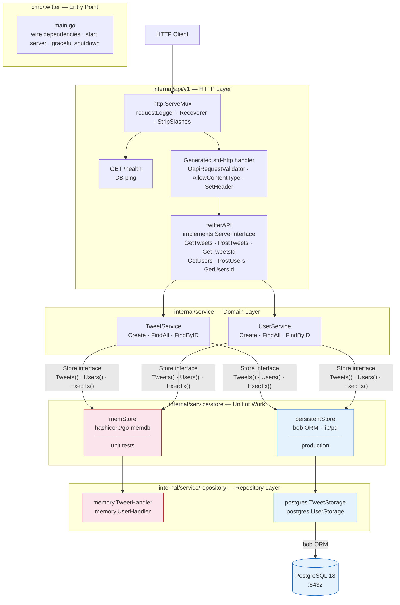

# Twitter Clone

## Objective

> Implement a Twitter clone. Write a simple web service in Go that has the following API endpoints:
>
> 1. Create a user.
> 2. List all users.
> 3. Get user profile by ID.
> 4. Create a tweet.
> 5. List all tweets.
> 6. Get tweet by ID.

---

## System Architecture

The application is structured around [Clean Architecture](https://blog.cleancoder.com/uncle-bob/2012/08/13/the-clean-architecture.html) principles, with strict layer separation enforced by Go package boundaries. Dependencies only point inward — outer layers know about inner layers, never the reverse.

### Component Diagram



> **Pink** — in-memory path used by unit tests (no Docker required).  
> **Blue** — PostgreSQL path used in production and integration tests.

### Request Flow

```
HTTP request
  └─ http.ServeMux
      ├─ middleware: requestLogger → Recoverer → StripSlashes
      ├─ GET /health → postgres.Storage.Ping
      └─ /api/v1/*
          ├─ generated std-http handler
          ├─ middleware: OapiRequestValidator  (validates against openapi.yaml)
          ├─ middleware: AllowContentType("application/json")
          ├─ middleware: SetHeader("Content-Type", "application/json")
          └─ twitterAPI handler  (internal/api/v1)
              └─ TweetService / UserService  (internal/service)
                  └─ Store.ExecTx / .Tweets() / .Users()  (internal/service/store)
                      └─ TweetRepository / UserRepository  (internal/service/repository)
                          ├─ [test]  memory handlers → go-memdb  (in-process)
                          └─ [prod]  postgres storage → bob ORM → lib/pq → PostgreSQL
```

### Type And Interface Mapping Across Layers

The HTTP, domain, and ORM layers each own their concrete types. The repository layer exposes interfaces rather than storage structs, keeping business logic decoupled from persistence details:

| Layer | Package | Types |
|---|---|---|
| HTTP | `internal/api/v1/openapi` | `openapi.User`, `openapi.Tweet` — generated DTOs |
| Domain | `internal/entities` | `entities.User`, `entities.Tweet` — pure domain models |
| Repository | `internal/service/repository` | `repository.UserRepository`, `repository.TweetRepository` — persistence interfaces |
| ORM | `internal/service/repository/postgres/models` | `models.User`, `models.Tweet` — bob-generated |

### Layer Descriptions

**`cmd/twitter`** — Binary entry point. Wires all dependencies, builds the root `http.ServeMux`, registers middleware, exposes `GET /health`, and starts the `net/http` server with graceful shutdown on `SIGINT`/`SIGTERM`.

**`internal/api/v1`** — HTTP handler layer. `twitterAPI` implements the oapi-codegen `ServerInterface`. Routes and request/response types are generated from [`openapi.yaml`](openapi.yaml) by `oapi-codegen` into `internal/api/v1/openapi/`.

**`internal/entities`** — Pure domain models (`User`, `Tweet`) with no external dependencies. The service layer always operates on these types.

**`internal/service`** — Application/domain logic. `TweetService` and `UserService` implement all use cases: email validation, tweet length enforcement (280 chars), user-existence checks inside transactions, and model mapping between layers.

**`internal/service/store`** — [Unit of Work](https://martinfowler.com/eaaCatalog/unitOfWork.html) abstraction. The `Store` interface groups repository access and transaction management:

```go
type Store interface {
    Tweets() repository.TweetRepository
    Users()  repository.UserRepository
    ExecTx(ctx context.Context, fn func(Store) error) error
}
```

Two implementations:
- **`memStore`** — backed by `hashicorp/go-memdb`; used in unit tests (no Docker required). `ExecTx` calls `fn(s)` directly; a `TransactionError` flag allows injecting failures in tests.
- **`persistentStore`** — backed by `bob.DB`; used in production. `ExecTx` calls `bob.DB.RunInTx`, starting a real PostgreSQL transaction. Inside the transaction, a `persistentStoreTx` wraps the `bob.Executor` so all repository calls share the same connection. Nested `ExecTx` is a no-op passthrough (PostgreSQL savepoints are not used).

**`internal/service/repository`** — Defines `TweetRepository` and `UserRepository` interfaces. Business logic depends on these contracts and the `entities` package, never on repository implementations directly.

**`internal/service/repository/memory`** — go-memdb implementation. Schema defines two tables (`users`, `tweets`) with indexes on `id`, `username`, and `email`. Each method manages its own atomic read/write transaction internally — no transaction state crosses the repository boundary.

**`internal/service/repository/postgres`** — PostgreSQL implementation using the [bob](https://github.com/stephenafamo/bob) ORM. Generated sub-packages (`models/`, `dberrors/`, `dbinfo/`) are produced by `bobgen-psql` from the live database schema.

---

## API Endpoints

Routes are generated from [`openapi.yaml`](openapi.yaml) and mounted at `/api/v1`:

```bash
GET  /health                 # Readiness / liveness check (DB ping)
GET  /api/v1/api.json        # Live OpenAPI spec
GET  /api/v1/tweets          # List all tweets
POST /api/v1/tweets          # Create a tweet
GET  /api/v1/tweets/{id}     # Get a tweet by ID
POST /api/v1/users           # Create a user
GET  /api/v1/users           # List all users
GET  /api/v1/users/{id}      # Get a user by ID
```

---

## Running the Application

### Prerequisites

- docker
- docker-compose

### Start

Ideally, the application should be launched from the Makefile. This ensures `docker-compose` is run with the correct environment variables. Otherwise, set the variables defined in `env-template`.

```bash
make docker-up
```

Runs in attached mode (logs visible). Stop in another terminal with:

```bash
make docker-down
```

### Example API calls

```bash
## Create a user
curl -v -X POST -H "Content-Type: application/json" \
  -d '{ "username": "foo", "name": "John Doe", "email": "jd@mail.com" }' \
  http://localhost:8888/api/v1/users

## List all users
curl -v http://localhost:8888/api/v1/users

## Store the first user ID
user_id=$(curl http://localhost:8888/api/v1/users | jq -r '.[0].id')

## Get a user by ID
curl -v http://localhost:8888/api/v1/users/$user_id

## Create a tweet
curl -v -X POST -H "Content-Type: application/json" \
  -d '{"user_id":"'$user_id'", "content": "Hello World!" }' \
  http://localhost:8888/api/v1/tweets

## List all tweets
curl -v http://localhost:8888/api/v1/tweets

## Store the first tweet ID
tweet_id=$(curl http://localhost:8888/api/v1/tweets | jq -r '.[0].id')

## Get a tweet by ID
curl -v http://localhost:8888/api/v1/tweets/$tweet_id
```

---

## Development

### Makefile Targets

Run `make help` to list all available targets:

```bash
# Database (Docker)
db-start                       Postgres start
db-stop                        Postgres stop
db-cli                         Start the Postgres CLI
db-migrate-down                Run database downgrade the last migration
db-migrate-up                  Run database upgrade migrations
db-migrate-version             Print the current migration version

# Code generation
openapi-generate               Generate OpenAPI client
db-orm-models                  Generate Go database models

# Development
dev                            Run development server
lint                           Lint and format source code based on golangci configuration

# Tests
test                           Run unit tests
test_integration               Run integration tests
test_e2e                       Run end-to-end tests

# Docker
api-start                      Run docker API container
api-stop                       Stop docker API container
docker-up                      Run docker container
docker-down                    Stop docker container
```

### Test Strategy

| Scope | Location | Type | Backend |
|---|---|---|---|
| Repository (memory) | `repository/memory/*_test.go` | Unit | go-memdb (in-process) |
| Repository (postgres) | `repository/postgres/*_test.go` | Integration (`integration` build tag) | testcontainers PostgreSQL |
| Store | `store/memstore_test.go`, `persiststore_test.go` | Unit / Integration | go-memdb / testcontainers |
| Service | `service/integration_test.go` | Integration | testcontainers via `persistentStore` |
| API (unit) | `api/v1/api_test.go` | Unit (`httptest.Server`) | `memStore` |
| API (integration) | `api/v1/integration_test.go` | Integration | testcontainers via `persistentStore` |
| E2E | `e2e/test.sh` | Shell (`diff` vs `expected.txt`) | Full Docker Compose stack |

```bash
make test                  # unit tests only (no Docker)
make test_integration      # requires Docker (testcontainers)
make test_e2e              # requires Docker Compose
```

### Code Generation

#### OpenAPI

Routes and types generated from [`openapi.yaml`](openapi.yaml) via [`oapi-codegen`](https://github.com/oapi-codegen/oapi-codegen):

```bash
make openapi-generate
```

#### Database Models

Models generated from the live database schema via [`bobgen-psql`](https://bob.stephenafamo.com/docs/code-generation/psql) (configured in [`bobgen.yaml`](bobgen.yaml)):

```bash
make db-orm-models
```

> **Note:** The database must be running and migrations applied before generating models.

### Local Development Setup

Start a local database (isolated Docker bridge network `twitter-clone-db`, bound to `127.0.0.1:5433`):

```bash
make db-start
```

Copy `env-template` to `.env` and adjust values as needed, especially `MIGRATIONS_PATH` if you plan to export the file directly.

The template contains shared `POSTGRES_*` settings plus context-specific connection strings for local dev, Compose, API-only Docker runs, and E2E runs (`DB_URL_LOCAL`, `DB_URL_COMPOSE`, `DB_URL_API_DEV`, `DB_URL_E2E`).

If you use `direnv`, the checked-in `.envrc` will load `.env` automatically. Otherwise export it manually before running commands that depend on those variables.

```bash
export $(egrep -v '^#' .env | xargs)
make db-migrate-up
```

Start the API:

```bash
make dev          # stop with Ctrl-C
```

Run tests and linter:

```bash
make test
make test_integration
make test_e2e
make lint
```

Stop the database when done:

```bash
make db-stop
```
